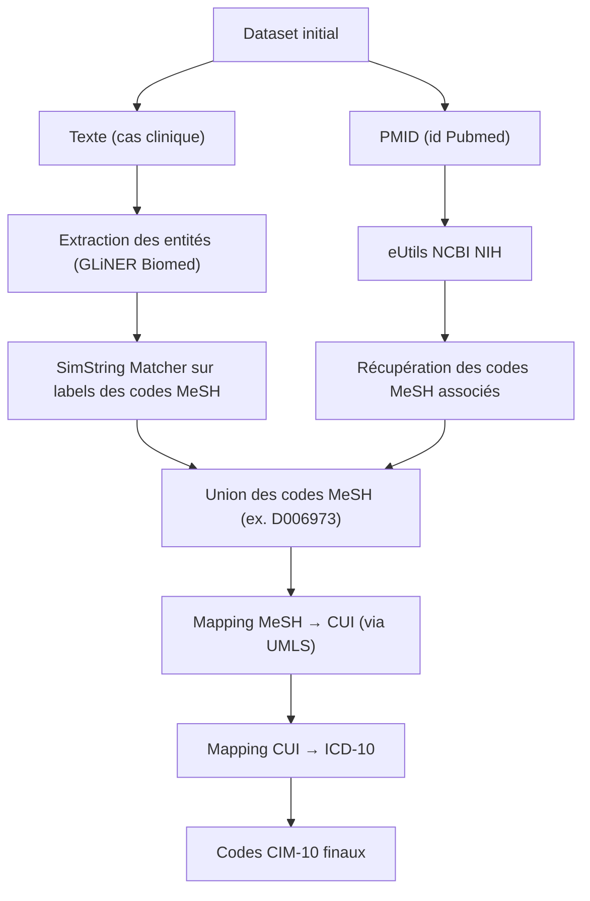

# AOC_0 - Pipeline d’enrichissement clinique MeSH / CIM-10

Pipeline complet d’enrichissement de cas cliniques francophones avec des entités médicales MeSH et des codes CIM-10, à l’aide de modèles biomédicaux et de sources comme UMLS et PubMed.

## Arborescence 

```text
├── create_database
│   ├── data
│   │   ├── dictionnaires
│   │   │   ├── cache_pubmed.json
│   │   │   ├── create_dictionnaires
│   │   │   │   ├── create_mesh_checktags.py
│   │   │   │   └── mesh_xml_to_json.py
│   │   │   ├── mesh_checktags.json
│   │   │   ├── mesh_dict.json
│   │   │   └── umls_mesh2icd_cache.json
│   │   └── local_databases
│   │       ├── edu3-clinical-fr+mesh
│   │       └── edu3-clinical-fr+mesh-2
│   ├── dvpt_scripts
│   │   ├── 1_create_database_codesMESH_with_gliner.py
│   │   ├── 2_add_mesh_from_pubmed_to_db.py
│   │   ├── 3_mesh_to_cim10.py
│   │   └── other
│   │       ├── debug_umls.py
│   │       ├── push_db_hub.py
│   │       └── TEST_gliner_simstring_pipeline.py
│   ├── __init__.py
│   ├── __pycache__
│   ├── src
│   │   ├── cli.py
│   │   ├── pipeline
│   │   │   ├── __init__.py
│   │   │   ├── build_pipeline.py
│   │   │   ├── gliner_detector.py
│   │   │   ├── icd10_mapper.py
│   │   │   ├── mesh_normalizer.py
│   │   │   ├── pubmed_fetcher.py
│   │   │   └── __pycache__
│   │   ├── pubmed
│   │   │   ├── fetch_mesh.py
│   │   │   ├── __init__.py
│   │   │   └── __pycache__
│   │   ├── __pycache__
│   │   └── utils.py
│   └── stats_desc
│       └── mesh_stats.ipynb
├── README.md
└── requirements.txt
```


## Installation

### 1. Créer un environnement virtuel

```bash
python3 -m venv aoc-env
source aoc-env/bin/activate
```

### 2. Installer les dépendances

```bash
pip install -r requirements.txt
```

## Exécution du pipeline

Le pipeline s’exécute via le script `cli.py`. Il peut être lancé avec les paramètres suivants :

```bash
python -m create_database.src.cli \
  --hf-token "hf_xxx" \
  --umls-api-key "abc123" \
  --dataset-name-initial "rntc/edu3-clinical-fr" \
  --dataset-name "clairedhx/edu3-clinical-fr-mesh-5"
```

### Arguments disponibles

* `--hf-token`: jeton Hugging Face pour pousser le dataset.
* `--umls-api-key`: clé API UMLS (disponible via UTS \[NLM]).
* `--dataset-name-initial`: nom du dataset source.
* `--dataset-name`: nom du dataset enrichi à créer/publier.

## Étapes du pipeline



## Dataset de sortie

Le dataset final contient notamment les colonnes suivantes :

* `detected_entities` : entités détectées par GLiNER + leur MeSH
* `mesh_from_gliner` : MeSH issus de la normalisation
* `pubmed_mesh` : MeSH récupérés via PubMed (API efetch)
* `union_mesh` : union des deux sources MeSH
* `inter_mesh` : intersection des deux sources
* `icd10_codes` : liste des codes CIM-10 associés
* `icd10_trace` : structure JSON retraçant le mapping (MeSH → CUI → ICD-10)
* `icd10_codes_reduct` : liste des codes ICD‑10‑CM réduits (supression des valeurs après le point et dédoublonnage)                                                         

### Exemple de `icd10_trace`

```json
{
  "M54": {
    "cui": "C0004604",
    "mesh_id": "D001416",
    "provenance": "gliner"
  },
  "A18.01": {
    "cui": "C0015967",
    "mesh_id": "D014394",
    "provenance": "pubmed"
  },
  "C00.1": {
    "cui": "C0206646",
    "mesh_id": "D002289",
    "provenance": "both"
  }
}
```

## Sources & Crédits

* 🧾 **Dictionnaire MeSH FR** (INSERM, format `.xml`, https://mesh.inserm.fr/FrenchMesh/index.htm)
* 🧠 **UMLS** via [U.S. National Library of Medicine](https://uts.nlm.nih.gov/)
* 🤖 **GLiNER-Biomed** : modèle de détection d’entités biomédicales (Hugging Face) -> Ihor/gliner-biomed-large-v1.0
* 📘 **Corpus** initial : `rntc/edu3-clinical-fr` (Paragraphes articles français PubMed via LLM)

---


